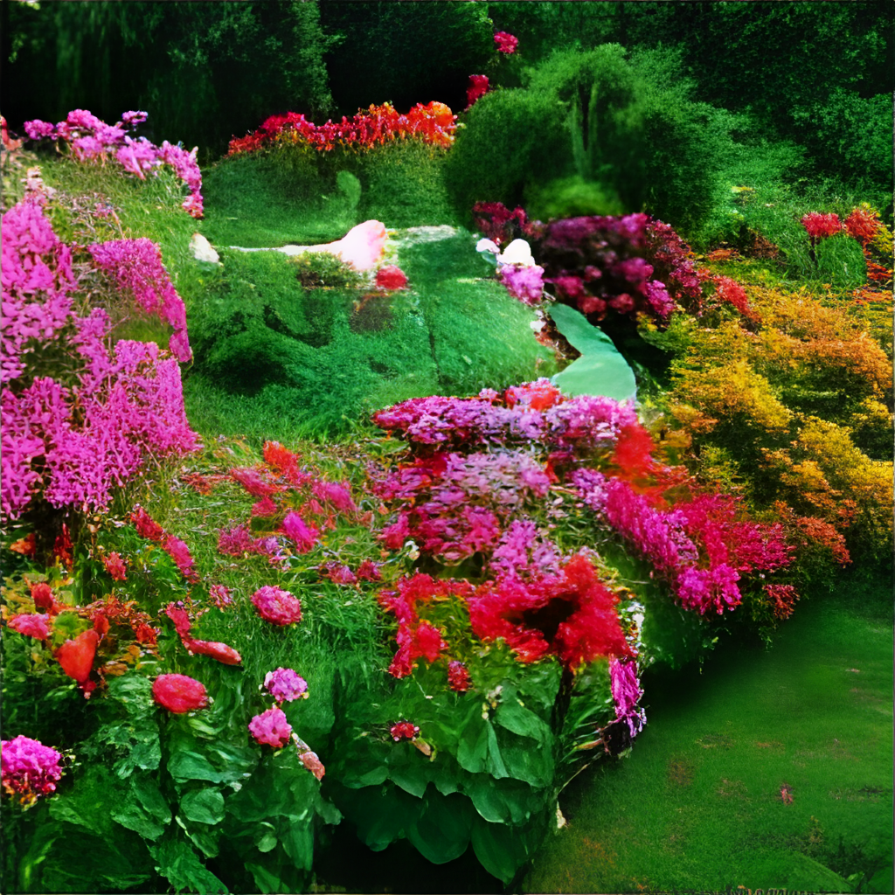
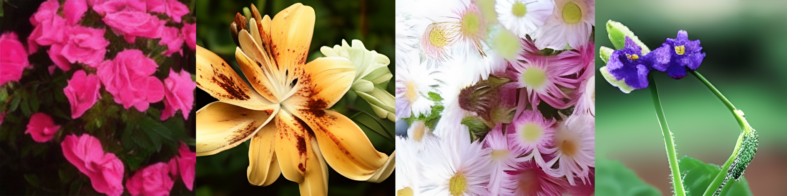
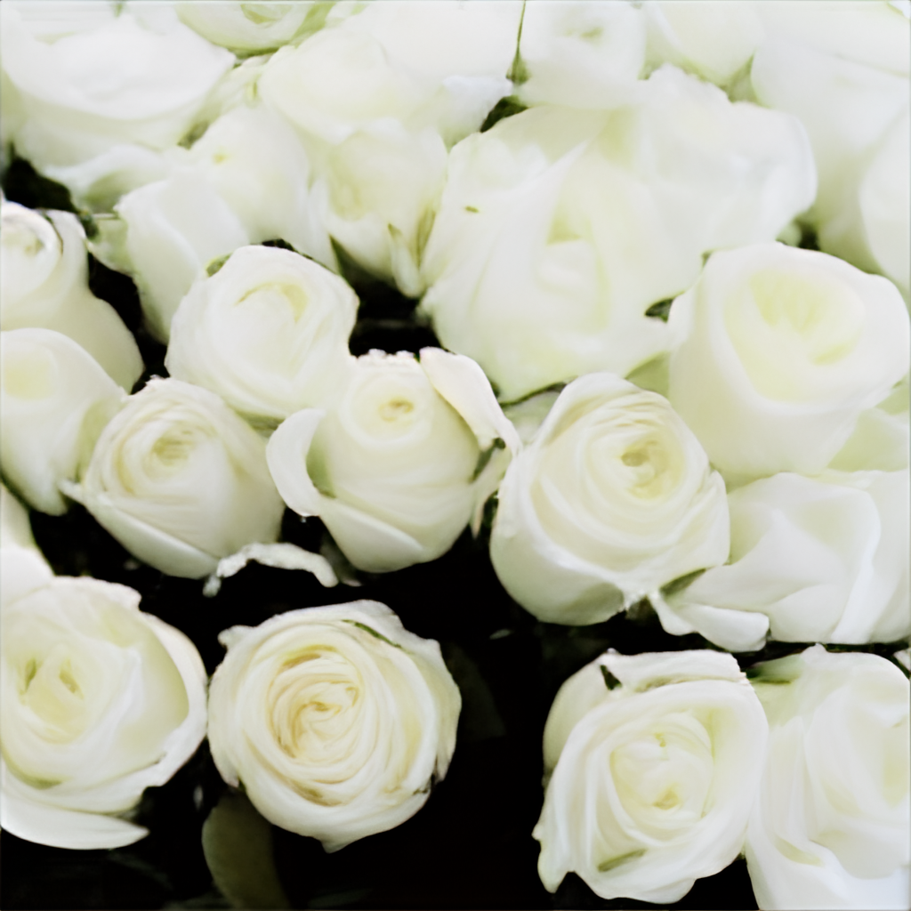
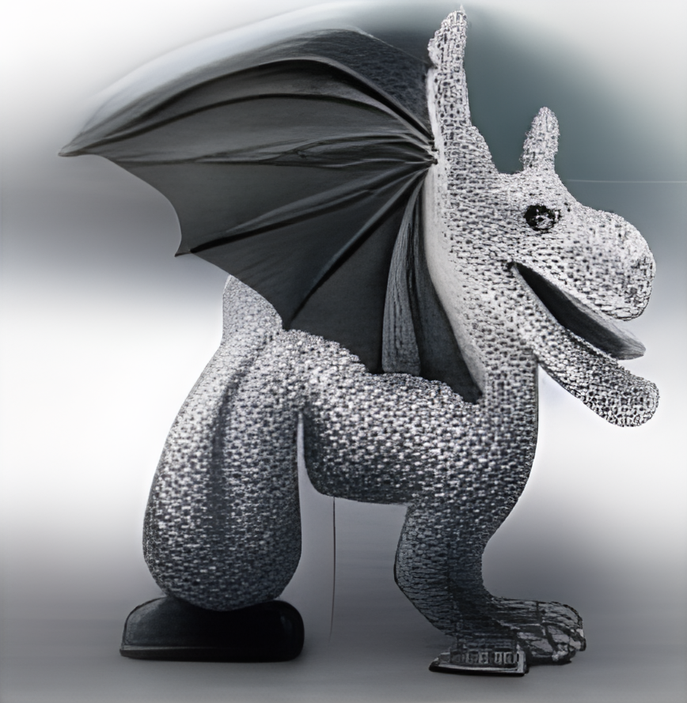
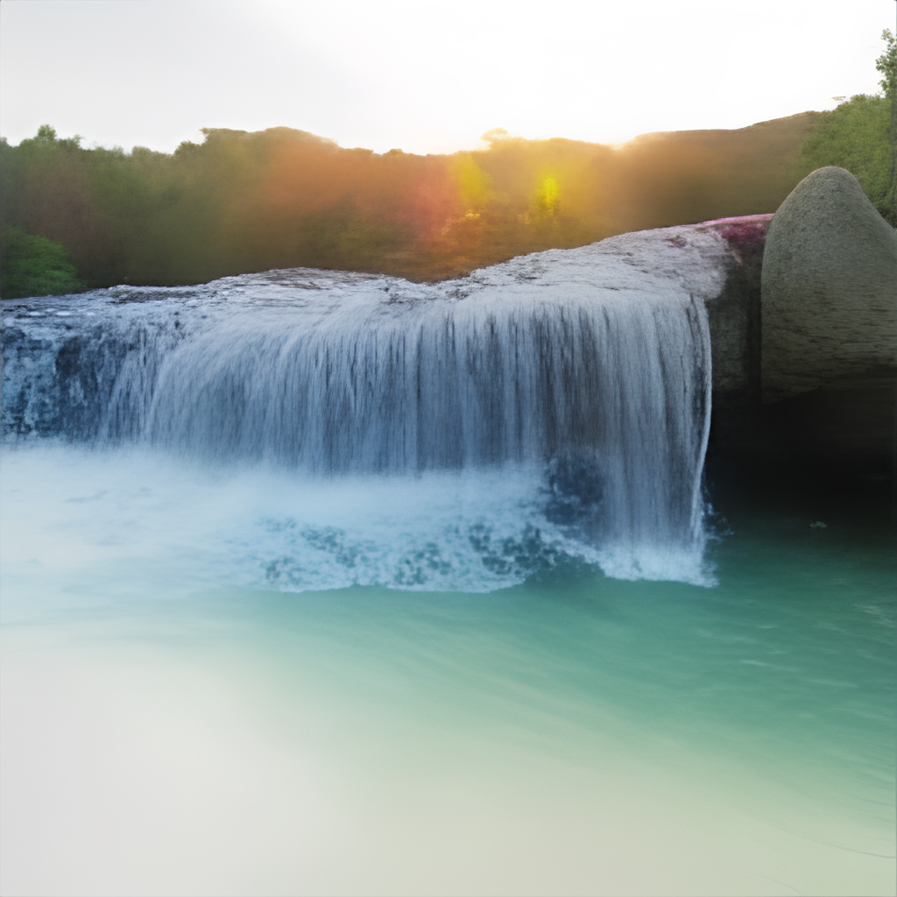
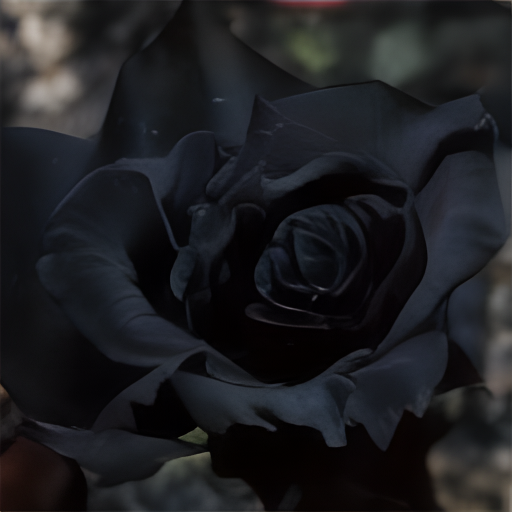

Last Sunday, I sat down with my son for some nerdy fun. The idea was to **write and illustrate** some short fairy tales using AI models. We used [GPT-3](https://github.com/openai/gpt-3) through the [OpenAI API](https://openai.com/blog/openai-api/) for writing, and an Open Source variant of [DALL-E](https://openai.com/blog/dall-e/) to generate illustrations from a text description (the more technical details can be found in the last section).

We started by writing the tales using the following procedure:

- We agreed on a starting sentence and used it to prompt the Language Model.

- The Language Model (Open AI [GPT-3](https://github.com/openai/gpt-3)) provided 5 alternative continuations.

- My son chose which of them to use. (This point was tricky because he tended to pick let's say *unexpected* options).

- I could choose whether we would use the complete continuation or take just a subset of it.

- Sometimes, we would manually add some small text, but we tried to do that as little as possible and we both had to agree on what to insert (tricky again...). We mainly used this possibility to prevent the LM from prematurely finishing the tale and, in the case of the first tale, to provide a proper ending. (More detail on these points in the Conclusions section).

Once the tale was finished, we agreed on some things that would be nice to portray and wrote text descriptions to prompt the DALL-E model.

And, without further ado, let's see those pieces of art:

# 1. Illustrated fairy tales

> Everything in this section, text and images, has been synthetically generated. The only exceptions are the words shown in **boldface**, used to prompt the text-generation system.
> 
> In the case of the images, no editing or postprocessing has been applied. The text used to prompt the image generation system is shown in the caption of each image.

# The secret garden

**Once upon a time, there was a king** and a queen who had a beautiful daughter. The princess was so lovely that the king and queen were always worried about her safety. They had a huge, fortified castle built to protect her.
The princess loved to play in the garden, and one day she found a secret door in the castle wall. She climbed through the door and found herself in a beautiful, secret garden. The garden was full of magic flowers that made the princess feel happy and safe.

<figure>
    
    <figcaption><em>Text prompt: "A beautiful garden with lots of flowers".</em></figcaption>
</figure>

The princess played in the garden every day, and she became very good friends with the flowers. The flowers told her all their secrets, and the princess learned that each flower had a special power.

The rosebush told her that it could make people fall in love. The lily told her that it could make people happy. The daisy told her that it could make people feel safe. And the violets told her that they could make people feel peaceful.

<figure>
    
    <figcaption><em>Text prompts: "A rosebush", "A lily plant", "A daisy plant, "Wild violets.</em></figcaption>
</figure>

**The princess kept this garden a secret, but used the power of the flowers to help everyone in the castle to be happy. But, one day, the princess discovered that all roses had turned black**. She didn't know what to do, so she went to the violets for help.

The violets told her that the roses must have been unhappy for a long time, and that their blackness was a sign of their unhappiness. They said that if the princess wanted the roses to be happy again, she would have to make them feel loved.

**'But, how do you make a rose feel loved?' said the princess.** The princess thought for a while, and then she had an idea.

She went outside and gathered all of the fallen petals from the roses. She then took them inside and arranged them in a beautiful bouquet.

She then went to the rose garden and gathered all of the roses. She placed the bouquet in the centre of the garden and said, 'I love you, roses. You make me happy.'

The roses then started to glow and their petals began to change colour. They turned from red to pink to yellow and finally to white. The rose garden was then filled with the most beautiful white roses.

<figure>
    
    <figcaption><em>Text prompt: "White roses".</em></figcaption>
</figure>

**The princess continued to visit the secret garden each day** and she would always find a different coloured rose waiting for her. **She always made sure that roses felt loved, lilies were happy, daisies felt safe, and violets were peaceful, since she had learned that, even the rosebush, needs roses from time to time.**

# The dragon of the falls

<figure>
    
    <figcaption><em>Text prompt: "A dragon made of stone".</em></figcaption>
</figure>

**Once upon a time, there was a dragon that lived under a waterfall.** Everyday, the dragon would eat the fish that lived in the stream. The villagers downstream were worried that the dragon would eat all the fish, so they asked a wizard to help.

The wizard cast a spell and turned the dragon into a stone statue. The villagers were so happy, they named the statue the “Dragon of the Falls” and they built a shrine to honor it.

**One day, however, the statue did break** and the dragon’s spirit returned to the waterfall. The dragon was very angry that it had been turned into a statue and promised to never eat the fish again. The villagers were so relieved, they named the waterfall “Dragon’s Falls” in honor of the dragon. The dragon’s spirit still lives there to this day.

<figure>
    
    <figcaption><em>Text prompt: "A waterfall falling into a water stream".</em></figcaption>
</figure>

# Bonus tales

> These shorter tales were generated on one go. They are cherry-picked from a total of 15 alternatives.

**Once upon a time, there was a dragon that lived under a waterfall**. He was very old and very wise. He had seen and heard everything that had ever happened in the forest. One day, a young rabbit came to him and asked for his advice. The rabbit said that he was in love with a deer, but he didn't know if the deer loved him back. The dragon told him to go and ask the deer. The rabbit did as the dragon said and the deer love him back.

**Once upon a time, there was a dragon that lived under a waterfall**. The dragon was very lazy and would only eat fish that swam past it. One day, a fish swam too close to the dragon and it gobbled it up. The dragon soon became very tired of eating fish and longed for something else. So, the dragon flew to the nearest grocery store and bought a pack of hot dogs.

**Once upon a time, there was a dragon that lived under a waterfall.** He was very lonely, so he decided to go on a journey to find a friend. He journeyed far and wide, but he couldn't find anyone to be his friend. Finally, he came to a village where he saw a little girl. He smiled at her and she smiled back. The dragon was so happy that he decided to stay with the little girl and be her friend.

**Once upon a time, there was a dragon that lived under a waterfall**. He was very lonely, so he asked the fairies to help him find a wife. The fairies took him to the most beautiful garden they had ever seen. There were all kinds of flowers and creatures there, but the dragon didn't see anyone he liked. Then, he saw the most beautiful fairy he had ever seen. She was more beautiful than the stars in the sky. The dragon asked her to be his wife, and she said yes. They lived happily ever after.

# 2. Conclusions and boring details

**Text generation** was performed using a large pretrained language model, in particular [GPT-3](https://github.com/openai/gpt-3) Davinci through the [OpenAI API](https://openai.com/blog/openai-api/). We have already talked about large pretrained language models in this blog, so I won't elaborate too much. You can take a look at previous posts or [this survey](https://arxiv.org/abs/2111.01243) if you want to delve deeper. I can, however, share some insights:

The tales were written with the new [instruct models](https://openai.com/blog/instruction-following/) (they are now the default models when using the API). I have not performed an extensive comparison, but these models seem to indeed consistently yield better results than their original counterparts.

The total context of the Davinci model is 2048 tokens, which means that, after a few sentences, it will tend to end the tale and, once all the context is used, it won't be able to generate more text. This makes it tricky to have an introduction, climax, and denouement.

In *The dragon of the falls*, our first attempt, you can see that the model provided an ending after the second paragraph. We made it continue by prompting again, but it just provided a new ending after a few sentences.

For *The secret garden*, what we did was to provide the model with a fixed-length context of 250 characters. This way, as we generate new text, we remove the older parts, creating room for new text to be generated. It is not ideal, since the model will *forget* what happened outside this context, but it seemed to work much better. I plan on continuing to tweak this approach to see how  closer can we get to having a real plot.

<figure>
    
    <figcaption><em>Text prompt: "A black rose".</em></figcaption>
</figure>

**Image generation** was performed using [ru-dalle](https://github.com/sberbank-ai/ru-dalle), a Russian, open source version of Open AI [DALL-E](https://openai.com/blog/dall-e/). DALL-E (and his Russian cousin) is a model that can convert a text query into an automatically-generated image. Just like that. Magic. From a more technical standpoint, it is, much like GPT-3, a transformer-based autoregressive model. It jointly models the text description and the image as a single stream of tokens and is trained to generate all of the tokens one after the other. That's why, given the text description, it can generate the image. The text is represented by, at most, 256 byte pair-encoded tokens, and the image by 1024 tokens created by compressing a 256x256 image to a 32x32 grid of tokens using a discrete variational autoencoder. A more detailed (and better) explanation can be found in the [paper](https://arxiv.org/abs/2102.12092).

DALL-E has not been publicly released. However, judging from the images in the [post](https://openai.com/blog/dall-e/), I would say that the quality of the images generated by [ru-dalle](https://github.com/sberbank-ai/ru-dalle) is much lower. That being said, writing a short text and having an image appear in front of you feels like magic, and it is extremely easy to do thanks to the [Colab notebook](https://github.com/sberbank-ai/ru-dalle/blob/master/jupyters/Malevich-3.5GB-vRAM-usage.ipynb) provided by the authors. The only bad thing is that the text input must be in Russian so I have spent the last few days using Google to translate cryptic sentences like *the dragon is under the waterfall* into Russian.
